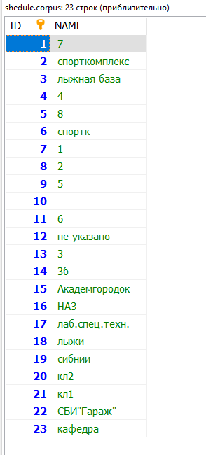

# Задача
Разработать REST API для получения расписания занятий.

# Структура базы данных

## auditory 
Кабинеты. В таблице хранится только номер кабинета. Например - **101**. Номер представлен в текстовом виде, т.к. не всегда это число. Номер корпуса указан в отдельной таблице. Поле **NAME** может быть пустой строкой, т.к. не у всех дисциплин указана аудитория.

  
Поля

|Название|Тип|Длина|Беззнаковое|По умолчанию|Описание|
|--------|---|-----|-----------|------------|--------|
|**ID**|INT|10|Да|AUTO_INCREMENT|уникальный идентификатор|
|**NAME**|VARCHAR|200|-|-|название кабинета|
|**ID_CORPUS**|INT|10|Да|-|идентификатор корпуса (внешний ключ на таблицу corpus)|

  
Пример

  

  
Индексы

  
**ID** - PRIMARY KEY

**ID_CORPUS** - FOREIGN KEY

## corpus 
Учебные корпуса. Номер представлен в текстовом виде, т.к. не всегда это число. Поле **NAME** может быть пустой строкой, т.к. не у всех дисциплин указан корпус.

  
Поля

|Название|Тип|Длина|Беззнаковое|По умолчанию|Описание|
|--------|---|-----|-----------|------------|--------|
|**ID**|INT|10|Да|AUTO_INCREMENT|уникальный идентификатор|
|**NAME**|VARCHAR|200|-|-|номер корпуса|

  
Пример

  

  
Индексы

  
**ID** - PRIMARY KEY

